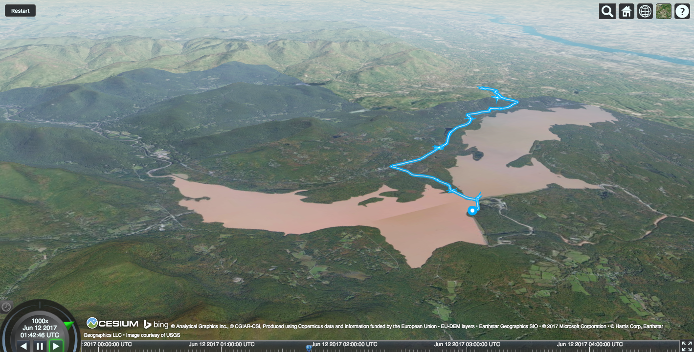

# GPXto3D
Mapping GPX data collected with Strava in 3D using CesiumJS

Live version here: https://willgeary.github.io/CesiumApps/Apps/Strava/

See the jupyter notebook in `notebooks/` for the code used to parse GPX, create CZML and visualize it in Cesium.
